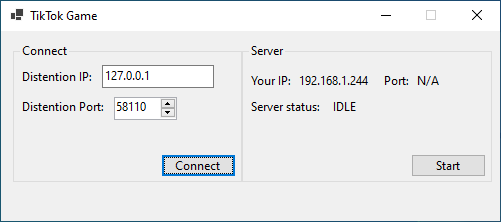
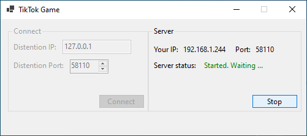
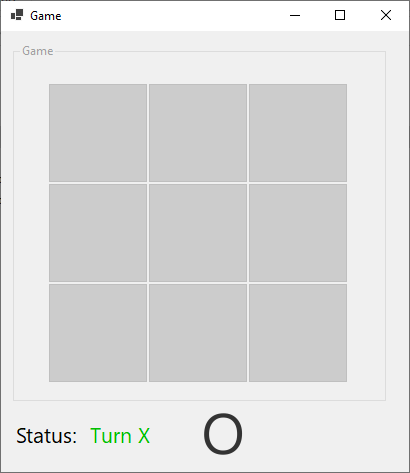
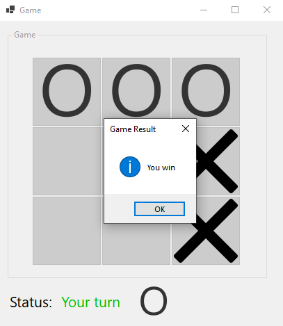

# TicTakGame

The simple Tic tac (X-O) game thats works in **LAN**. This game was develope with `C#` and `.NET Core 3.1`.

This game use **TCP** socket communication to interact with other computer in **LAN** network

## How it's work

1. In first page of application we have two section, one for start server and host the game and another one for connect to running server.

2. For tcp communication in C# I use [`TcpListener`](https://learn.microsoft.com/en-us/dotnet/api/system.net.sockets.tcplistener) for listen for incoming connection and act like a server and [`TcpClient`](https://learn.microsoft.com/en-us/dotnet/api/system.net.sockets.tcpclient) for making connection to server

3. After connection was made between server and client we should have a **Handshake** thats give players id and select roles for players randomly, then pick one player thats start the game.

4. Now we ready to play. In the last after each move on the table we have to demeter is anyone win or not or maybe we had no winner and game was draw

## Screenshots

|  | 
|--|--|
|  | 
